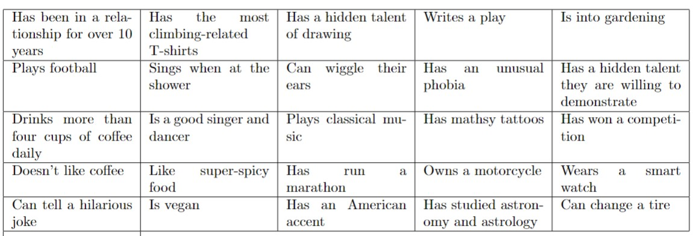

# Find_the_guest_BINGO

Generate printable BINGO cards for the game "Find the Guest -- BINGO". Each BINGO card is a 5x5 grid. Each entry of the grid is a description of a guest of yours or a person in general. :-) 
The grids contain 25 entries which are randomly chosen from your customised list of descriptions.

## Prerequisites
- Python (any version 3.x)
- LaTeX (I use Overleaf online editor)
- Coffee or tea
## Instructions

### Step 1: Preparation
Poor boiled water over tea or coffee and let it brew.  Whilst waiting download the files below:
- `guest_descriptions.txt`: Text file where you can customise the descriptive sentences for your guests.
- `generate_latex_files.py`: Python script to generate the LaTeX files for the game grids.
- `main.tex`: LaTeX file for the main document.

Make sure they are saved in the same folder on your computer.
Open the file "guest_descriptions.txt" and read the default descriptions. Observe the formatting: one descriptive sentence per line.

### Step 2: Creative thinking!
Time to enjoy your tea or coffee whilst thinking about your guests' particularities and interesting facts.
Costumise the list in "guest_descriptions.txt" by deleting descriptions that do not match. Add sentences customised to your guests.
Remember one descriptive sentence per line. Aim for at least 30 descriptions in total. The more sentences you add, the more the grids will differ from one another.
Once you are happy with your list, save and close the file.

### Step 3: Python time
Open your Python editor and run the file "generate_latex_files.py". You will be prompted to enter the number of cards to generate. For example, if you have 20 guests, enter 20 (one card per guest). Once you run the code, it will generate a few LaTeX files and save them in the same folder along with the downloaded files.
Input: Number of cards to generate

Outputs:
- latex_tables.tex
- card01.tex 
- card02.tex
- ...
- card.XX.tex
  

### Step 4: LaTeX time
Open your LaTeX editor and upload all the files generated by the Python script, plus the "main.tex".
I.e., all files with the ".tex" extension. Compile the LaTeX document to generate the PDF output. 
Finish off your tea or coffee. 

Here are some examples of what the grids may look like:

Caption: BINGO card number 1

Caption: BINGO card number 2

By the way, if you have any suggestions or improvements for making the tables even prettier, I welcome your contribution! Please submit a pull request with your changes :)

### Step 5: Game time!
Print off the PDF from LateX and give one grid to each guest. To cross out a box, they need to write the name of the person with the description. The first to get BINGO wins the game. Consider having a trophy for added fun! Enjoy!
