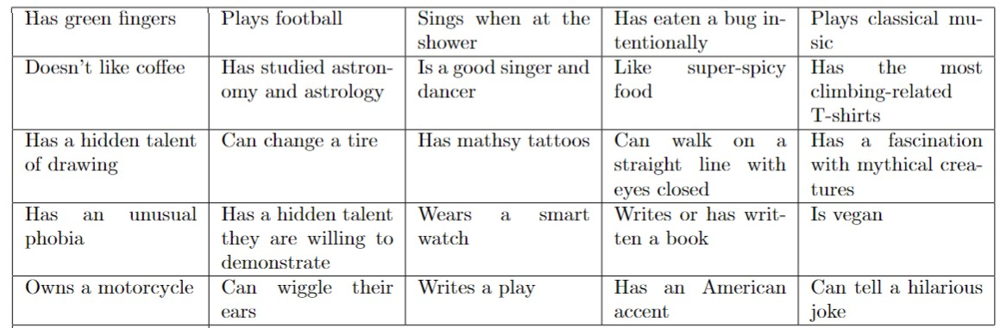

# Find_the_guest_BINGO

Generate printable grids for the game "Find the Guest -- BINGO". Each grid has a size of 5x5. Each entry of the grid has a sentence that describes a guest of yours or a person in general. The grids differ from one another, but they have many questions in common.

## Prerequisites
- Python (any version 3.x)
- LaTeX

## Instructions

### Step 1: Download the repository

Download the files below and save them in a folder on your computer.
- `guest_descriptions.txt`: Text file where you can customize the descriptive sentences for your guests.
- `generate_latex_files.py`: Python script to generate the LaTeX files for the game grids.
- `main.tex`: LaTeX template file for the main document.

### Step 2: Being creative time!
Think of descriptive sentences for your guests. Update the text file "guest_descriptions" and customize it according to your friends. The minimum number of descriptions is 26, but it is recommended to have more than 30 to ensure substantial differences between each grid.

### Step 3: Python time
Open your Python editor and run the file "generate_latex_files.py". You will be prompted to enter the number of cards to generate. This will generate all the LaTeX files you need and save them in the same folder where you downloaded the repository. It will create one "main.tex" file and one cardxx.tex file for each card/grid.

Input: Number of cards to generate

Outputs:
- main/tex
- card01.tex
- card02.tex
- ...

### Step 4: LaTeX time

Open your LaTeX editor and upload all the files generated by the Python script, including the "main.tex" file and the individual "cardxx.tex" files. Compile the LaTeX document to generate the PDF output. 

If you have any suggestions or improvements for making the tables even prettier, I welcome your contribution! Please submit a pull request with your changes :)

### Step 5: Game time!
Print off the PDF from LateX and give one grid to each guest. To cross out a box, they need to write the name of the person with the description. The first to get BINGO wins the game. Consider having a trophy for added fun! Enjoy!
